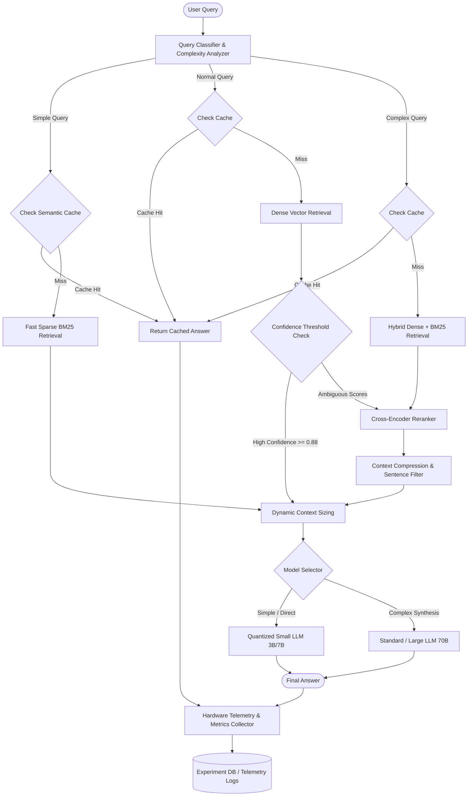

# 04. EcoRAG System Architecture

This document provides the end-to-end architectural specification for the EcoRAG platform, detailing the ingestion pipeline, the adaptive runtime query pipeline, and the experiment manager benchmarking harness.

---

## 1. High-Level Adaptive System Architecture

The core innovation of EcoRAG is its **Adaptive Query Routing Engine**: instead of running an invariant brute-force pipeline for all queries, the system dynamically routes queries through the minimal sufficient computational path.



---

## 2. Component Specifications

### 2.1. Document Ingestion Subsystem (Offline)

```
                    ┌─────────────────────────┐
                    │    Source Documents     │
                    └────────────┬────────────┘
                                 │
                                 ▼
                    ┌─────────────────────────┐
                    │  Configurable Chunker   │
                    │ (128 / 256 / 512 / 1024)│
                    └────────────┬────────────┘
                                 │
                                 ▼
                    ┌─────────────────────────┐
                    │   Chunk Deduplicator    │
                    │   (MinHash / SHA-256)   │
                    └────────────┬────────────┘
                                 │
                                 ▼
                    ┌─────────────────────────┐
                    │    Embedding Service    │
                    │  (MiniLM / BGE / E5)    │
                    └────────────┬────────────┘
                                 │
                                 ▼
                    ┌─────────────────────────┐
                    │     Vector Store        │
                    │  (FAISS Flat/HNSW/Qdrant│
                    └─────────────────────────┘
```

1. **Document Loader & Extractor:** Parses PDFs, Markdown, HTML, and text files.
2. **Chunker Engine:** Implements variable chunk strategies (fixed token sizes with overlapping sliding windows, sentence splitters, or recursive character splitters).
3. **Chunk Deduplicator:** Filters redundant chunks before vectorization, saving embedding compute and vector index storage.
4. **Vector Database / Index Manager:** Builds in-memory FAISS indices or syncs with Qdrant collections.

---

### 2.2. Query Processing & Classification Subsystem (Online)

1. **Query Classifier:**
   - Evaluates incoming query length, keyword density, and semantic ambiguity.
   - Categorizes queries into **Simple** (lookup/factoid), **Normal** (single-concept explanation), or **Complex** (multi-concept comparison or multi-hop synthesis).
2. **Cache Hierarchy:**
   - **L1 (Exact):** In-memory dictionary / Redis key-value (`hash(query)`).
   - **L2 (Semantic):** Lightweight FAISS index of past queries; computes cosine distance. If $\ge 0.92$, returns answer immediately.
   - **L3 (Vector Cache):** Caches query embedding vectors to avoid duplicate encoder forward passes.

---

### 2.3. Retrieval & Filtering Subsystem

1. **Dual-Path Retriever:**
   - **Sparse (BM25Okapi):** Fast inverted-index token matching; zero GPU power.
   - **Dense (FAISS):** Inner product or cosine distance over normalized embeddings.
   - **Hybrid Fusion:** Combines ranks via Reciprocal Rank Fusion (RRF):
     $$\text{RRF Score}(d) = \sum_{m \in \{\text{Dense}, \text{BM25}\}} \frac{1}{60 + \text{Rank}_m(d)}$$
2. **Adaptive Reranker Gate:**
   - Checks the top retriever score $\text{Score}_1$ and margin $\Delta = \text{Score}_1 - \text{Score}_2$.
   - If $\text{Score}_1 \ge \tau_{\text{confident}}$, skips cross-encoder reranking entirely.
   - If ambiguous, routes candidate chunks through a cross-encoder (e.g., `bge-reranker-base` or FlashRank).
3. **Context Compressor:**
   - Filters out non-informative sentences from retrieved chunks.
   - Dynamically caps prompt context tokens to the minimum required for an accurate answer.

---

### 2.4. Generation Subsystem

1. **Model Cascade Router:**
   - Trivial queries are satisfied by compact, 4-bit quantized local models (e.g., Ollama running `llama3.2:3b-instruct-q4_K_M`).
   - Deep reasoning queries are escalated to higher-capacity models.
2. **Constrained Prompting Engine:**
   - Enforces concise, factual outputs to curb wasteful autoregressive token generation.

---

## 3. The Experiment Manager & Benchmarking Harness

To conduct rigorous empirical research across the 1,944 potential pipeline combinations, EcoRAG features an automated **Experiment Manager**:

```
                       ┌─────────────────────────┐
                       │   Experiment Manager    │
                       └────────────┬────────────┘
                                    │
                                    ▼
                       ┌─────────────────────────┐
                       │  Configuration Matrix   │
                       │ (Chunk, DB, Rerank, etc)│
                       └────────────┬────────────┘
                                    │
            ┌───────────────────────┴───────────────────────┐
            ▼                                               ▼
   ┌───────────────────┐                           ┌───────────────────┐
   │ Evaluation Runner │                           │ Telemetry Monitor │
   └────────┬──────────┘                           └────────┬──────────┘
            │                                               │
            ▼                                               ▼
   • Benchmark questions                           • CodeCarbon (Wh)
   • Golden answer check                           • psutil (RAM/CPU)
   • Recall@K / MRR                                • pynvml (GPU Watts)
   • Answer correctness                            • High-res Timers
            │                                               │
            └───────────────────────┬───────────────────────┘
                                    │
                                    ▼
                       ┌─────────────────────────┐
                       │  Results & Pareto Store │
                       │    (SQLite / MLflow)    │
                       └────────────┬────────────┘
                                    │
                                    ▼
                       ┌─────────────────────────┐
                       │  Interactive Dashboard  │
                       │    (Plotly/Streamlit)   │
                       └─────────────────────────┘
```

### Key Capabilities of Experiment Manager
- **Ablation Studies:** Isolates individual variables (e.g., measuring the exact delta in Wh and Recall when enabling vs. disabling a Cross-Encoder).
- **Batch Evaluation:** Runs standardized QA test sets (e.g., SQuAD, HotpotQA, or domain-specific manuals).
- **Pareto Frontier Calculation:** Automatically discovers the non-dominated configurations that maximize accuracy while minimizing energy consumption.
