# 06. Experiment Matrix & Recommended Tech Stack

Conducting empirical research on EcoRAG requires navigating a large combinatorial parameter space and selecting an optimal technology stack that supports deterministic hardware measurement.

---

## 1. The 1,944-Combination Experiment Matrix

A full grid search across all 7 experimental dimensions generates:

```
  4 Chunk Sizes          (128, 256, 512, 1024 tokens)
× 3 Embedding Models     (MiniLM-L6-v2, BGE-small, E5-base)
× 3 Vector Databases     (FAISS In-Memory, Chroma Embedded, Qdrant)
× 3 Retrieval Methods    (Dense Bi-Encoder, BM25 Sparse, Hybrid RRF)
× 2 Reranker Options     (None, Cross-Encoder)
× 3 Cache Strategies     (No Cache, Semantic Cache, Multi-Tier Cache)
× 3 Context Windows      (1K, 2K, 4K tokens)
─────────────────────────────────────────────────────────────
= 1,944 Unique Pipeline Configurations
```

### Navigating the Search Space Without Brute Force
Running all 1,944 pipelines on full test datasets is both computationally expensive and environmentally counterproductive. EcoRAG employs structured search techniques:

1. **Ablation Studies:** Establish a solid baseline, then toggle one variable at a time (e.g., change only the chunk size while holding embeddings, retrieval, and LLM constant).
2. **Fractional Factorial Design:** Samples orthogonal combinations that maximize parameter coverage.
3. **Sequential Elimination (Staged Pruning):**
   - *Stage 1:* Identify the top 2 embedding models on a fixed chunk size.
   - *Stage 2:* Test chunk sizes only on those top 2 embedding models.
   - *Stage 3:* Benchmark reranker vs. non-reranker on the best retrieval configurations.
4. **Bayesian Optimization:** Fits a Gaussian Process over the hyperparameter space to predict the Pareto frontier with minimal trial runs.

---

## 2. Concrete Baseline vs. Overhauled Experiment Example

```
┌────────────────────┬─────────────────────────────┬─────────────────────────────┐
│ Dimension          │ Baseline Configuration      │ Optimized EcoRAG Candidate  │
├────────────────────┼─────────────────────────────┼─────────────────────────────┤
│ Chunk Size         │ 512 tokens                  │ 256 tokens + dynamic filter │
│ Embedding Model    │ BGE-large (1024d)           │ BGE-small (384d)            │
│ Vector Store       │ FAISS FlatIP                │ FAISS FlatIP (In-memory)    │
│ Retrieval Mode     │ Dense Vector                │ Hybrid (BM25 + Dense)       │
│ Reranker           │ Heavy Cross-Encoder (all)   │ Threshold-gated Reranker    │
│ Caching Layer      │ None                        │ L1 Hash + L2 Semantic Cache │
│ Context Window     │ Fixed 4K tokens             │ Dynamic Context (min-req)   │
│ LLM Generator      │ Llama-3-70B (cloud API)     │ Quantized Llama-3.2-3B local│
├────────────────────┼─────────────────────────────┼─────────────────────────────┤
│ Retrieval Recall@5 │ 91%                         │ 93%                         │
│ Answer Accuracy    │ 92.5%                       │ 91.8% (-0.7%)               │
│ Latency (TTFT)     │ 2.40 seconds                │ 0.35 seconds (6.8× faster)  │
│ Host RAM           │ 4.8 GB                      │ 1.6 GB (3.0× less)          │
│ Energy per Query   │ 6.5 Watt-hours              │ 0.8 Watt-hours (8.1× green) │
│ Cost per 1k Ans    │ $18.50                      │ $0.40 (46× cheaper)         │
└────────────────────┴─────────────────────────────┴─────────────────────────────┘
```

---

## 3. Recommended Technology Stack

The stack is designed around Python and FastAPI, utilizing **local LLMs** to enable deterministic, direct physical hardware power measurement:

```
┌────────────────────────────────────────────────────────────────────────┐
│                        RECOMMENDED TECH STACK                          │
├──────────────────────┬─────────────────────────────────────────────────┤
│ Component            │ Technology Choice                               │
├──────────────────────┼─────────────────────────────────────────────────┤
│ Backend Framework    │ Python 3.10+ / FastAPI / Uvicorn                │
│ RAG Pipeline Core    │ LangChain or LlamaIndex                         │
│ Dense Embeddings     │ `sentence-transformers` (BGE-small, MiniLM)     │
│ Sparse Retrieval     │ `rank-bm25`                                     │
│ Vector Databases     │ `faiss-cpu` / `faiss-gpu`, `qdrant-client`      │
│ Rerankers            │ `sentence-transformers` Cross-Encoder, FlashRank│
│ Local LLM Server     │ Ollama / vLLM (GGUF / AWQ 4-bit models)         │
│ Telemetry & Energy   │ `codecarbon`, `psutil`, `pynvml`                │
│ Experiment Storage   │ SQLite / DuckDB / MLflow                        │
│ Visual Dashboard     │ Streamlit / Plotly                              │
└──────────────────────┴─────────────────────────────────────────────────┘
```

### Why Local Models (Ollama / vLLM)?
Commercial APIs (OpenAI, Anthropic) do not disclose the physical wattage of their servers, and cloud network latency introduces uncontrollable noise into benchmarking. Running local quantized models (e.g., via Ollama or vLLM) allows exact milliwatt tracking via Intel RAPL and NVIDIA NVML.

---

## 4. Recommended Project Progression (Milestones)

```mermaid
gantt
    title EcoRAG Implementation Roadmap
    dateFormat  X
    axisFormat %d

    section Phase 1: Foundation
    Baseline RAG & Document Ingestion           :p1_1, 0, 5
    Hardware Telemetry Harness (CodeCarbon/psutil) :p1_2, 3, 8

    section Phase 2: Ingestion & Retrieval
    Chunking & Embedding Benchmarks (384d vs 768d) :p2_1, 8, 14
    Dense vs Sparse vs Hybrid Retrieval Sweep   :p2_2, 12, 18

    section Phase 3: Reranker & Context
    Selective / Gated Reranker Optimization     :p3_1, 18, 24
    Context Compression & Dynamic Context       :p3_2, 22, 28

    section Phase 4: Caching & Adaptation
    Multi-Tier Semantic & Exact Caching         :p4_1, 28, 34
    Adaptive Query Classifier & Model Router    :p4_2, 32, 40

    section Phase 5: Synthesis
    Pareto Analysis & Experiment Dashboard      :p5_1, 40, 46
    Final Report / Research Paper Production    :p5_2, 44, 50
```



### Milestone Details
1. **Milestone 1 — Baseline & Instrumentation:** Stand up a standard RAG pipeline in FastAPI; attach `psutil`, `codecarbon`, and timing decorators to record energy and latency per query.
2. **Milestone 2 — Retrieval & Ingestion Sweeps:** Test 128, 256, 512, and 1024 token chunks against MiniLM and BGE-small; measure offline indexing energy vs. online retrieval Recall@K.
3. **Milestone 3 — Reranker & Context Compression:** Implement threshold-gated reranking; measure the exact delta in Wh and MRR when bypassing the cross-encoder for high-confidence matches.
4. **Milestone 4 — Caching & Dynamic Sizing:** Integrate exact hash and semantic cosine caching; measure cache hit energy savings.
5. **Milestone 5 — Adaptive Orchestrator & Dashboard:** Build the end-to-end adaptive router; visualize the Accuracy vs. Energy Pareto frontier in an interactive Streamlit/Plotly UI.
